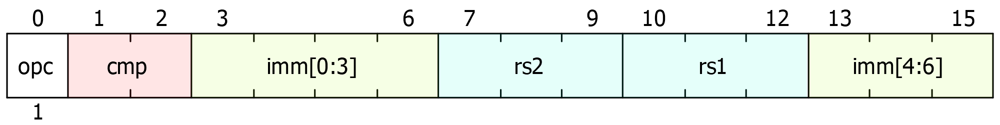
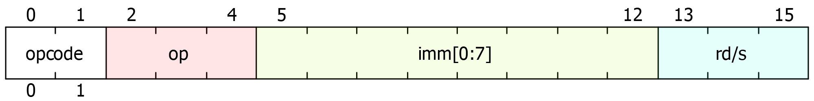
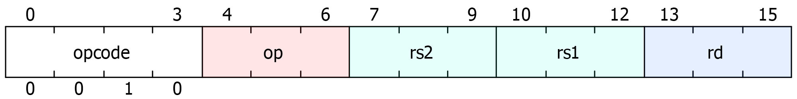
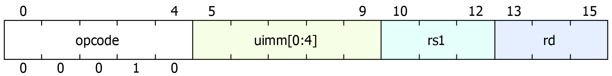
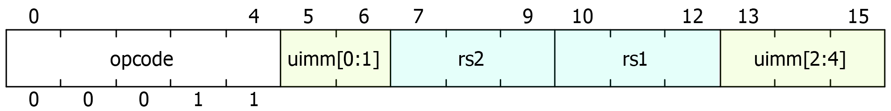
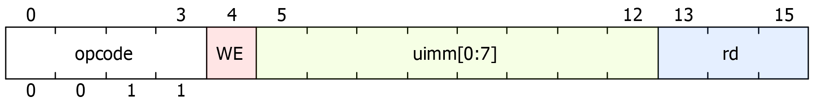
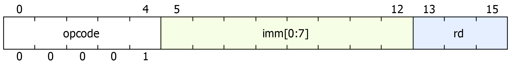
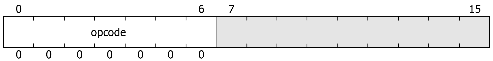
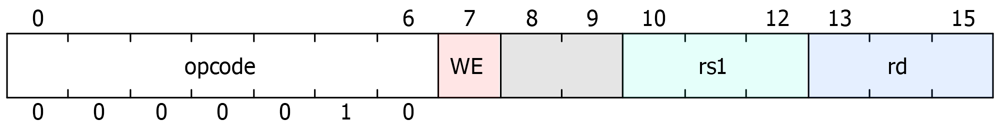
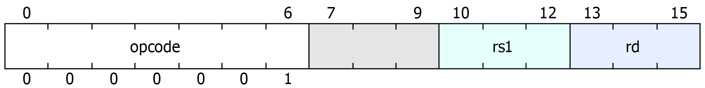

# ISA

## Overview

- 8-bit RISC computer (8 bit addresses, 8 bit ALU, 8 bit registers, ...)
- Harvard architecture (separate data and instruction memory units)
- Single cycle processor

**Instructions:**
- 16 bit, fixed-length instructions
- Inspired by RISC-V, subset of commands

**Memory:**
- Main memory: 256 bytes of addressable RAM
- Instruction memory (ROM): 256 instructions, each 16 bit (internally: 512 bytes of memory)

> [!NOTE]
> By keeping instructions and data in separate memory units and handling them separately (*Harvard Architecture*), the amount of usable memory significantly increases. 256 bytes are then available solely for data, and 256 addresses available for instructions. As all instructions have the same size, the addresses do not have to refer to byte location, but can instead be used as indices, allowing for (256 * instruction size) bytes of instruction memory.
> 
> 16-bit instruction width was chosen...
> - ... as a personal challenge.
> - ... as a good compromise between flexibility and memory consumption.

## Registers

- 8 general-purpose registers (3 bit addresses)
- `x1`, `x2`, `x3`, ..., `x8`
- Lax usage convention:
	- `x8` can be used as the stack pointer (`sp`)
	- `x7` can be used as the return address (`ra`)

> [!NOTE]
> - There are only 8 registers in order to fit into 16 bit instruction format.
> - In order to make the most of these registers, there is no zero register like in RISC-V: The instructions were specifically designed and chosen so that a hardwired zero register is not needed. E.g. mv rd, rs; j and jal implemented separately, ...
> - This also explains why there is no `x0` register. In RISC-V the `x0` / `zero` register is hardwired to 0 and therefore behaves very differently from the other general purpose registers. In order to prevent possible confusion and errors, I have decided to skip `x0` and instead start at `x1`.

## Data Types

All values, including addresses, are stored as 8-bit binary integers. Negative numbers are represented in two's complement.

## Instructions

### Arithmetic and Logic Instructions

- Format `op rd, rs1, rs2`
- Performs an arithmetic / logic instruction on the values in the two source registers and stores the result in the destination register.

| Mnemonic | Description         |                        |
| -------- | ------------------- | ---------------------- |
| `add`    | add                 | `rd = rs1 + rs2`       |
| `sub`    | sub                 | `rd = rs1 - rs2`       |
| `mul`    | mulitply            | `rd = rs1 * rs2`       |
| `sll`    | shift left logical  | `rd = rs1 << rs2[0:2]` |
| `srl`    | shift right logical | `rd = rs1 >> rs2[0:2]` |
| `and`    | bitwise and         | `rd = rs1 & rs2`       |
| `or`     | bitwise or          | `rd = rs1 \| rs2`      |
| `xor`    | bitwise xor         | `rd = rs1 ^ rs2`       |

> [!NOTE]
> As bitwise shifts are only useful for offsets of 0 to 7 bits, only the lower 3 bits of the specified value are used. See `rs2[0:2]`. Same applies to instruction versions with immediates.

### Arithmetic and Logic Instructions with an Immediate

- Format `op rd/s, imm[8]`
- Source and destination registers are the same. In other words, the operation is performed on the specified register and the given immediate and the result is stored in the same register.
- The immediate value is 8 bits wide and is taken as-is. It can therefore represent negative or unsigned positive numbers.

| Mnemonic | Description              |                   |
| -------- | ------------------------ | ----------------- |
| `addi`   | add immediate            | `rd += imm`       |
| `subi`   | sub immediate            | `rd -= imm`       |
| `muli`   | multiply imm.            | `rd *= imm`       |
| `slli`   | shift left logical imm.  | `rd <<= imm[0:2]` |
| `srli`   | shift right logical imm. | `rd >>= imm[0:2]` |
| `andi`   | bitwise and imm.         | `rd &= imm`       |
| `ori`    | bitwise or imm.          | `rd \|= imm`      |
| `xori`   | bitwise xor imm.         | `rd ^= imm`       |

> [!NOTE]
> In order to accommodate full 8-bit immediate values, there is not enough space in the 16 bit instruction format to also encode 3 registers (`log2(8) = 3` bits each), the instruction opcode and the ALU operation. That's why these instructions work in-place on the target register, which is different from the behaviour of ALU instructions with immediates in RISC-V.

### Load / Store Instructions

Load:
- `lb rd, uimm[5](rs)`
- Reads a byte from the main memory at the address `[rs + uimm]` into register `rd`. 
- As the 5-bit immediate value is zero-extended, only positive offsets can be used.

Store:
- `sb rs2, uimm[5](rs1)`
- Stores the value in `rs2` in the main memory at address `[rs + uimm]`.
- As the 5-bit immediate value is zero-extended, only positive offsets can be used.

| Instruction         | Description |                         |
| ------------------- | ----------- | ----------------------- |
| `lb rd, uimm(rs)`   | load byte   | `rd = mem[rs + uimm]`   |
| `sb rs2, uimm(rs1)` | store byte  | `mem[rs1 + uimm] = rs2` |

### Unconditional Jump Instructions

- Sets the program counter (internal `PC` register) to the specified absolute address (either specified by an immediate or stored in a register).
- Optionally also stores the address of the next instruction in the given register.

|                          | Do not store return address | Store return  address (link) |
| ------------------------ | ------------------------------ | ------------------------------- |
| Address in  immediate | `j`                            | `jal`                           |
| Address in  register  | `jr`                           | `jalr`                          |

| Instruction       | Description            |                        |
| ----------------- | ---------------------- | ---------------------- |
| `j uimm[8]`       | jump                   | `pc = uimm`            |
| `jr rs`           | jump register          | `pc = rs`              |
| `jal rd, uimm[8]` | jump and link          | `rd = pc+1, pc = uimm` |
| `jalr rd, rs`     | jump and link register | `rd = pc+1, pc = rs`   |

> [!NOTE]
> Note that these instructions look very similar to those found in RISC-V. The difference is that `j` and `jr` and not implemented as pseudo instructions. For example, in RISC-V `j imm` can be rewritten as `jal x0, imm`, using the hardwired-zero `x0` register as the destination register for the next instruction address, essentially discarding the value. As this ISA does not have such a register, these two commands must be implemented separately. 

### Branch Instructions

- Format `bxx rs1, rs2, imm[6]`
- Moves the program counter by the specified value if a condition applies to the given registers. Otherwise, the computer moves to the next instruction.
- The immediate is sign extended, which means that forwards and backwards jumps can be performed.

| Mnemonic | Description                                    |                             |
| -------- | ---------------------------------------------- | --------------------------- |
| `beq`    | branch on equal                                | `if (rs1 == rs2) pc += imm` |
| `bne`    | branch on not equal                            | `if (rs1 != rs2) pc += imm` |
| `bltu`   | branch on less than (unsigned)              | `if (rs1 < rs2) pc += imm`  |
| `bgeu`   | branch on greater than  or equal (unsigned) | `if (rs1 >= rs2) pc += imm` |

See the pseudo instructions for syntactic sugar for the `gtu` and `leu` conditions.

### Additional Register Instructions

| Instruction     | Description    |            |
| --------------- | -------------- | ---------- |
| `mv rd, rs`     | move / copy    | `rd = rs`  |
| `li rd, imm[8]` | load immediate | `rd = imm` |

> [!NOTE]
> As there is no direct equivalent to `addi rd, x0, imm` (and similar instructions) to load constants and to copy values from one register to another, these instructions had to be implemented separately (not as pseudo instructions).

### Misc Instructions

| Mnemonic | Description   |
| -------- | ------------- |
| `nop`    | has no effect |

> [!NOTE]
> The `nop` instruction was added so that if the programs execution is finished, the following non-existent instructions (zeroed data) have no effect. That's why the `nop` instruction is encoded as all-zeroes.
> 
> Note that if no endless loop is added at the end of the program, the program counter will eventually overflow, essentially restarting program.

### Pseudo Instructions

| Pseudo Instruction   | Description                                | Translation           |
| -------------------- | ------------------------------------------ | --------------------- |
| `bleu rs1, rs2, imm` | branch on less than or equal (unsigned) | `bgeu rs2, rs1, imm`  |
| `bgtu rs1, rs2, imm` | branch on greater than (unsigned)       | `bltu rs2, rs1, imm`  |
| `call label`         | call a function                            | `jal ra, label`       |
| `ret`                | return                                     | `jr ra`               |
| `not rd`             | bitwise logical not                        | `xori rd, 0b11111111` |
| `la rd, label`       | load an address                            | `li rd, label`        |

## IO

The computer has 16 input buttons and a 6x8 binary LED output matrix. The inputs and outputs can be accessed via the main memory (*memory mapped IO*). Each input button row and each LED row is represented by one byte in memory.

Outputs:
- The uppermost output row (row `0`) can be written to (and read from) address `248`. 
- The most significant bit is at the left, the least significant bit at the right. This means that writing a number to a row will show its "human-readable" representation in base 2.
- The remaining output rows can be accessed from the higher addresses (`249`, ..., `253`).

Inputs:
- The upper 8 buttons (row `A`) are available at address `254`, the lower 8 buttons (row `B`) at address `255`.
- The encoding is the same as the outputs: the most significant bit is at the left.
- These memory addresses are read-only. Writing to them will have no observable effect.

See the *Assembly Reference* for useful constants that can be used when programming IO.

## Instruction Encodings

### Branch

- The immediate encodes a relative address and is sign-extended to 8 bits.
- `cmp` specifies the comparison operation:
	- `0`: EQ (equal)
	- `1`: NEQ (not equal)
	- `2`: LT (less than)
	- `3`: GE (greater than or equal)

### ALU Immediate

- The immediate encodes an arbitrary 8-bit signed or unsigned integer for the second operand of the target operation.
- `op` specifies the ALU operation:
	- `0`: ADD
	- `1`: SUB
	- `2`: MUL
	- `3`: SLL
	- `4`: SRL
	- `5`: AND
	- `6`: OR
	- `7`: XOR

### ALU

- See above for `op`.
### Load

- The immediate encodes a non-negative offset which is zero-extended to 8 bits.

### Store

- The immediate encodes a non-negative offset which is zero-extended to 8 bits.

### Jump (and Link)

- The immediate encodes the absolute address of the jump target.
- The `WE` (Write Enable) bit determines whether to write the address of the next instruction to `rd`. If `WE=0`, then this instruction behaves like `j target`, otherwise like `jal target, rd`.

### Load Immediate

- The immediate encodes an arbitrary 8-bit signed or unsigned integer.

### NOP

- Has no effect.

### Jump (and Link) Register

- See `JAL` for information regarding the `WE` bit.

### Move

### Legend

- `opcode`: specifies the instruction type
- `rs1`: source register 1
- `rs2`: source register 2
- `rd`: destination register
- `rd/s`: source and destination register
- `uimm`: unsigned integer immediate
- `imm` (8 bit): signed or unsigned integer immediate
- `imm` (<8 bit): signed integer immediate

> [!NOTE]
> - Due to the limited 16-bit size of the instructions and the considerable amount of data required by certain instructions (such as the branch instruction), I had to use a variable-length opcode. Although this complicates the decoding process, it allows the computer to support a broader range of instructions and enables each instruction to be more expressive, for example, increasing the range of the branch jump offset.
> - Since 8-bit immediates already match the word size of the computer, they do not require sign or zero extension. As a result, the hardware does not impose a specific interpretation, allowing the programmer to interpret them as needed based on the context.