# Components

## Computer

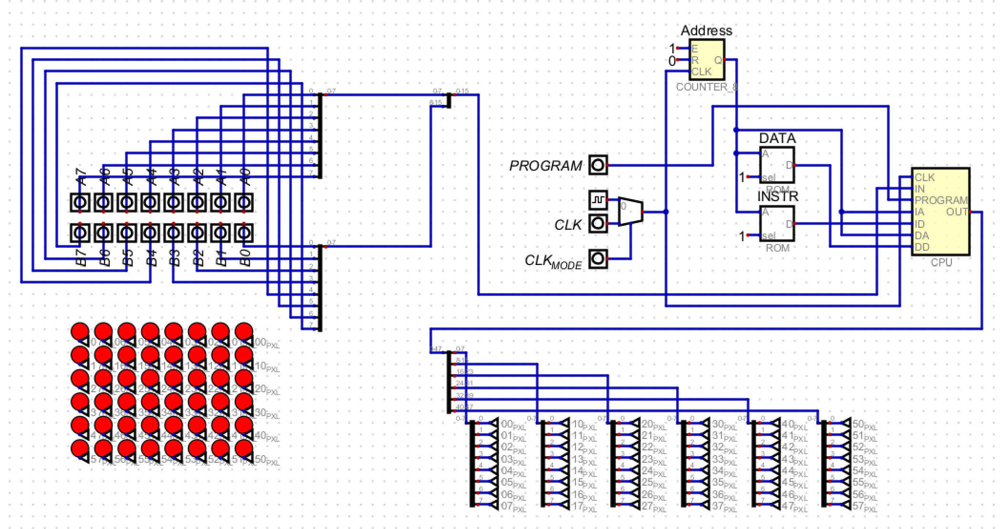

## CPU

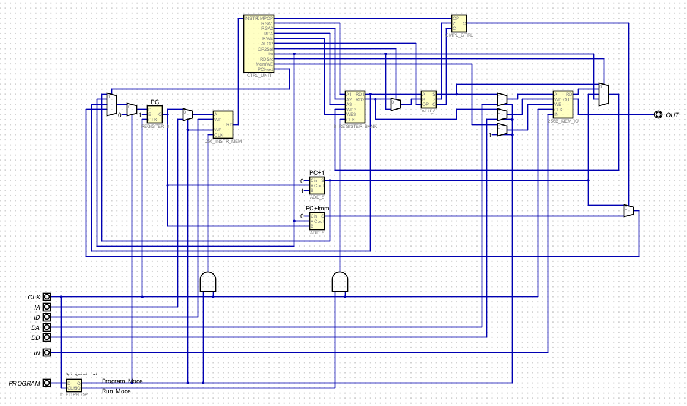

## ALU

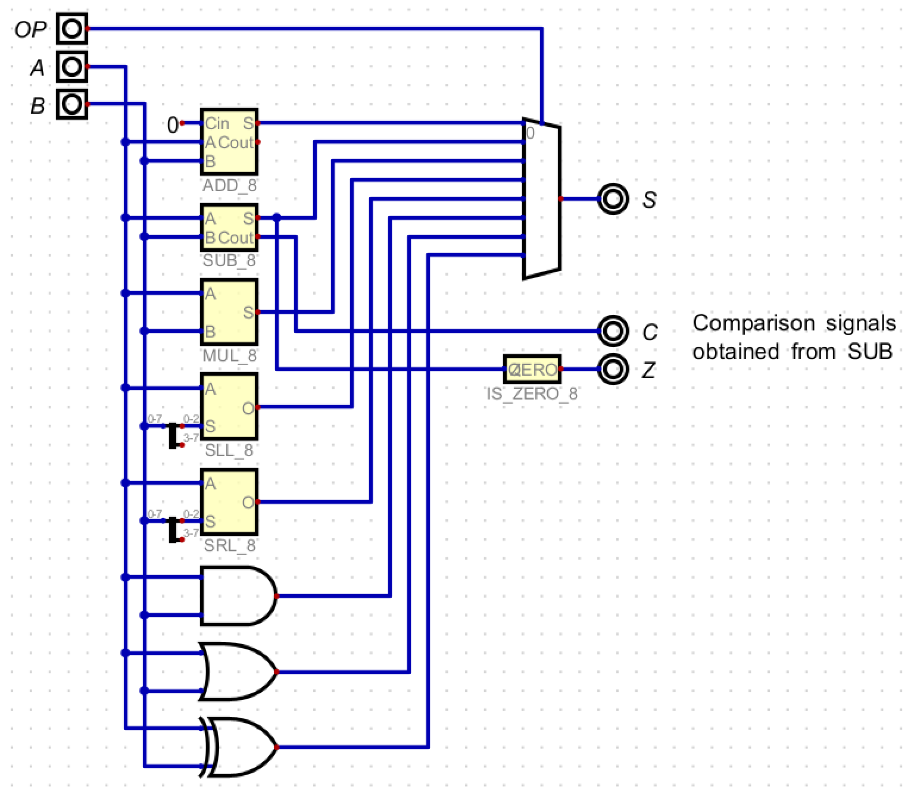

## Conditional Sum Adder

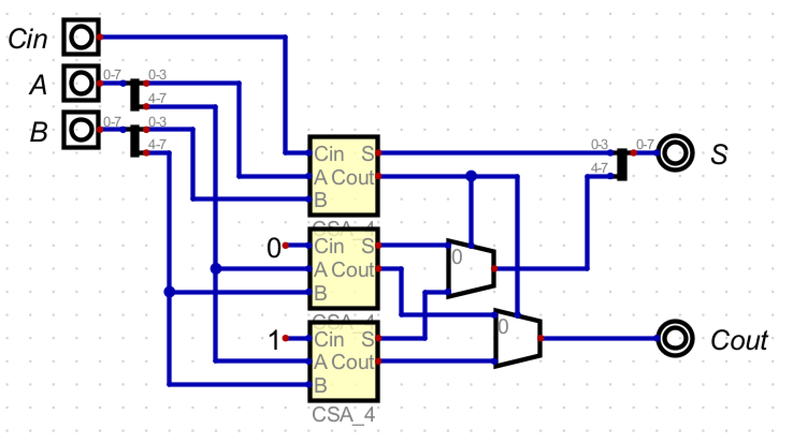

## Multiplier

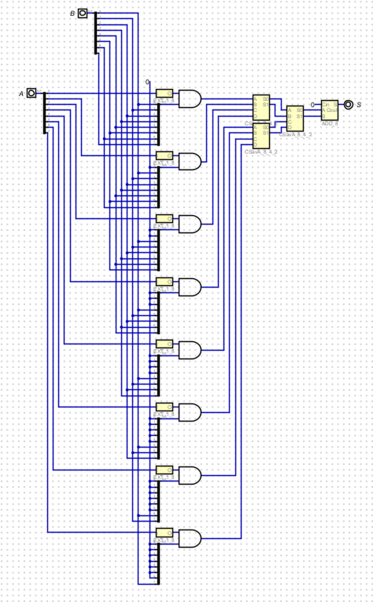

## Carry Save Adder

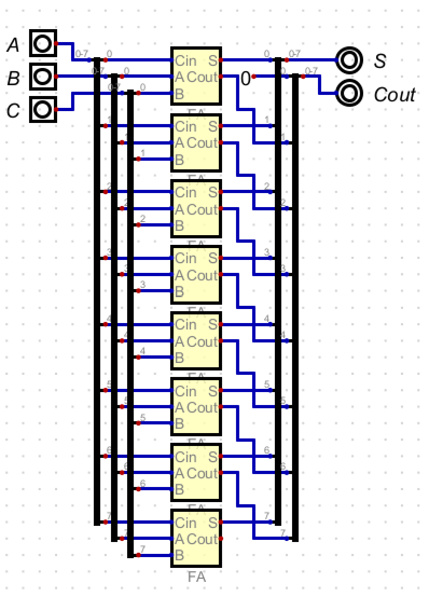

## Control Unit

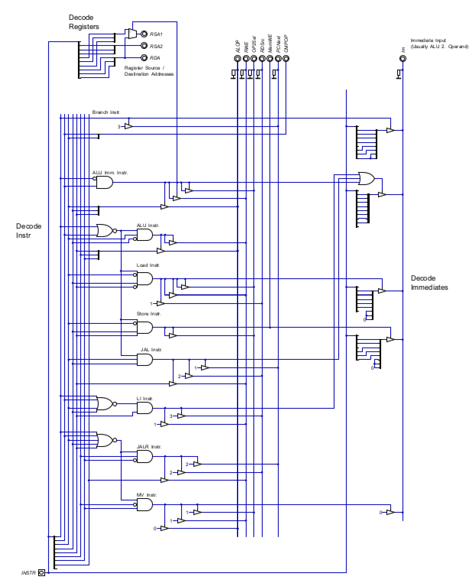

## 256 Byte Memory

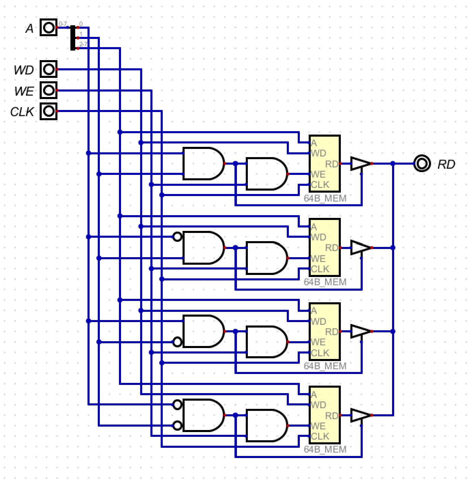

## 64 Byte Memory

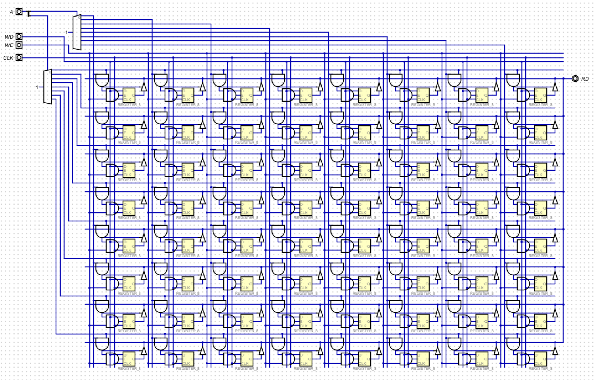

## 8-Bit Register

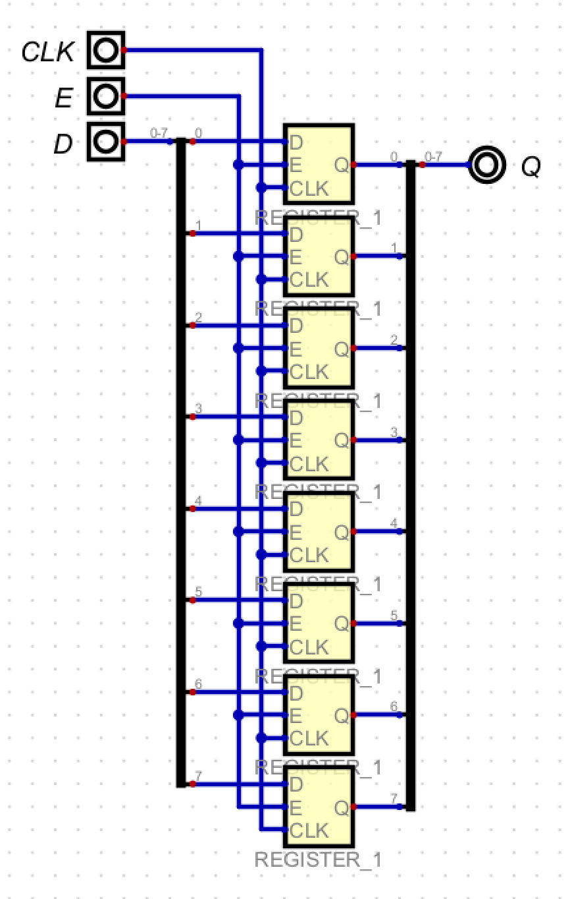

## 1-Bit Register

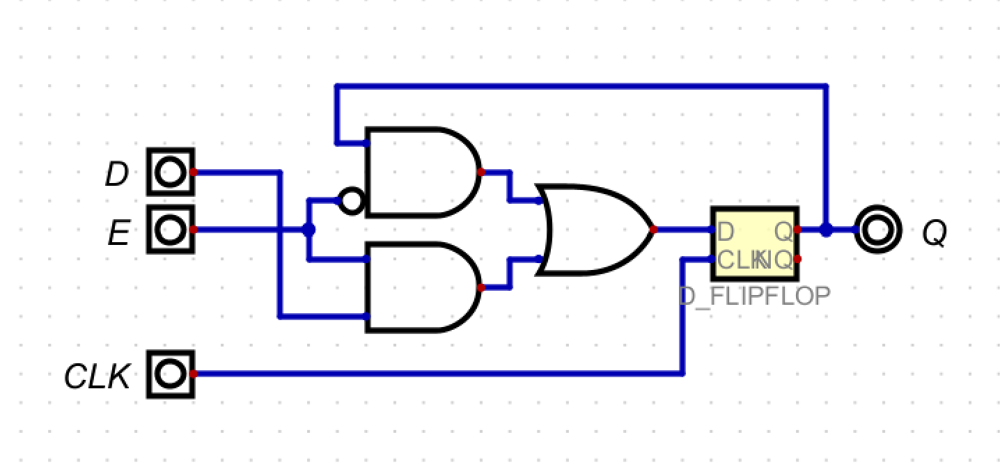

## Register File

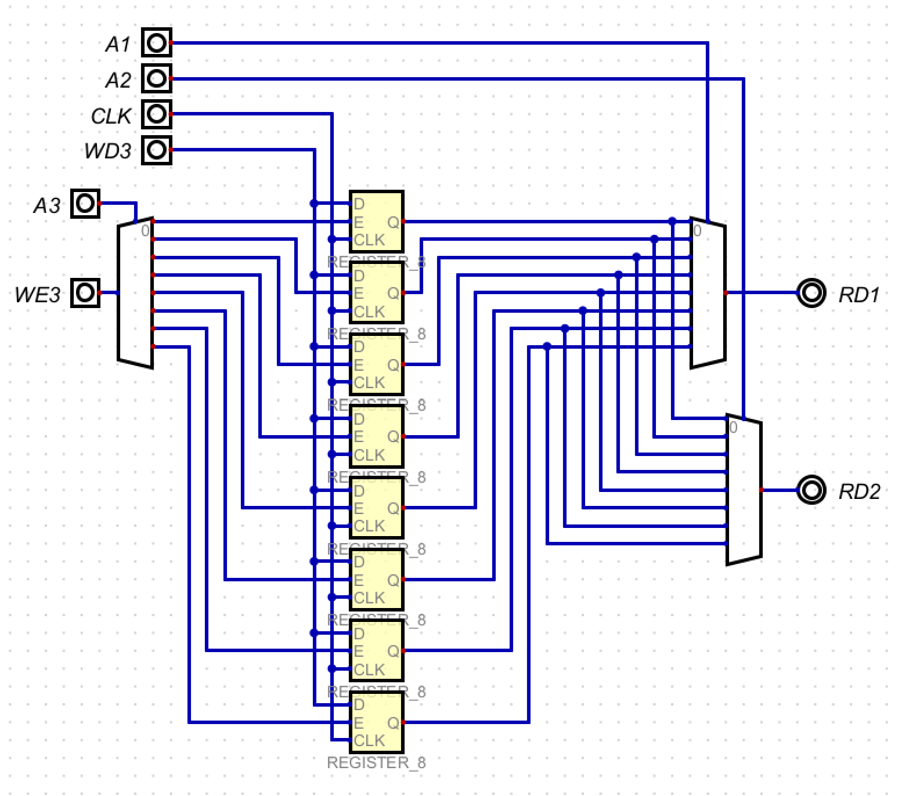

## Memory Mapped IO

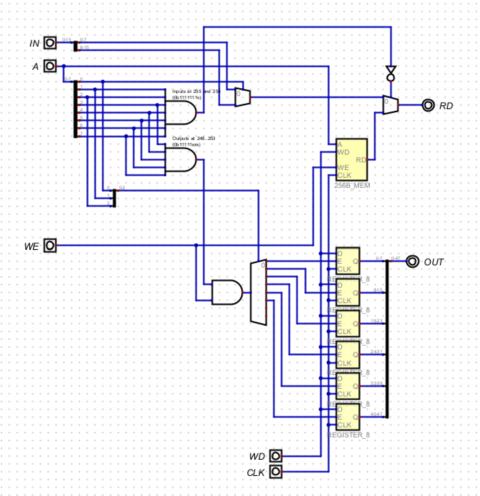

## Shift Left Logical

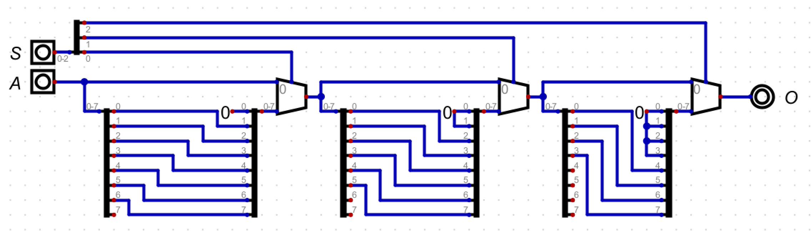

## Shift Right Logical

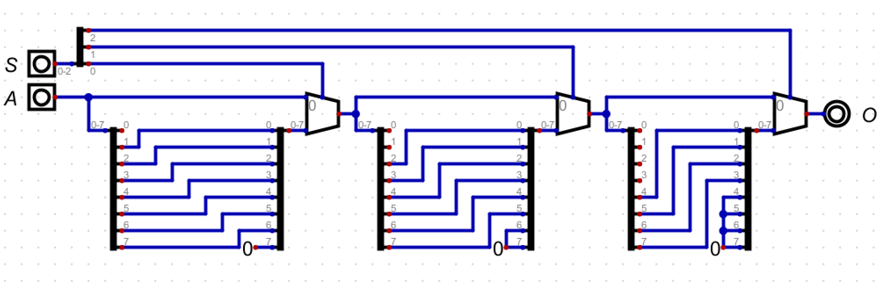

## Shift Right Arithmetic

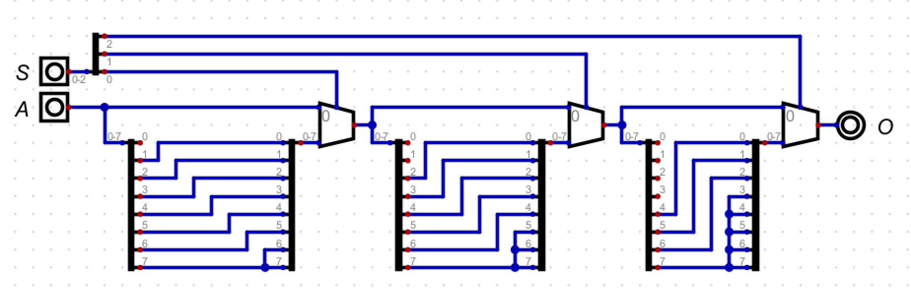